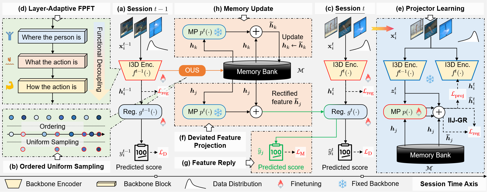

<div align="center">
  <div>
    <h1>
        MAGR++: Adaptive Manifold-Aligned Graph Regularization for Continual Action Quality Assessment
    </h1>
  </div>

  <div>
    <strong>Kanglei Zhou</strong>,  
    <a href="https://scholar.google.com/citations?user=MeNSCpQAAAAJ"><strong>Qingyi Pan</strong></a>,  
    <a href="https://indussky8.github.io/"><strong>Xingxing Zhang</strong></a>,  
    <a href="http://hubertshum.com/"><strong>Hubert P. H. Shum</strong></a>,  
    <a href="https://frederickli.webspace.durham.ac.uk/"><strong>Frederick W. B. Li</strong></a>,  
    <a href="https://orcid.org/0000-0001-6351-2538"><strong>Xiaohui Liang</strong></a>,  
    and <a href="https://lywang3081.github.io/"><strong>Liyuan Wang</strong></a>*
  </div>

  <br/>
  <div>
    Extended Version of <a href='https://github.com/ZhouKanglei/MAGR_CAQA'>MAGR (ECCV 2024 Oral Presentation)</a>
  </div>
  <br/>
</div>

---

This repository contains the implementation of **MAGR++ (`magrpp`)**, an advanced framework for **Continual Action Quality Assessment (CAQA)**.  
MAGR++ extends MAGR by integrating **layer-adaptive fine-tuning** and **asynchronous feature rectification**, effectively addressing the stability–adaptability dilemma in continual learning.  The model combines **Manifold Projector (MP)** and **Intra–Inter–Joint Graph Regularization (IIJ-GR)** to mitigate feature drift and regressor confusion while maintaining storage efficiency through **feature replay**.



---

## 🔧 Requirements

- torch==1.12.0  
- torchvision==0.13.0  
- torchvideotransforms  
- tqdm  
- numpy  
- scipy  
- quadprog  

Install dependencies:
```bash
pip install -r requirements.txt
```

---

## 📂 Dataset Preparation

### MTL-AQA

Download from [MTL-AQA repository](https://github.com/ParitoshParmar/MTL-AQA).

```bash
$DATASET_ROOT
├── MTL-AQA/
│   ├── new/
│   │   ├── 01 ...
│   ├── info/
│   │   ├── final_annotations_dict_with_dive_number
│   │   ├── test_split_0.pkl
│   │   └── train_split_0.pkl
│   └── model_rgb.pth
```

### UNLV-Dive (AQA-7)

```bash
mkdir AQA-Seven && cd AQA-Seven
wget http://rtis.oit.unlv.edu/datasets/AQA-7.zip
unzip AQA-7.zip
```

Organize as:

```bash
$DATASET_ROOT
└── Seven/
    ├── diving-out/
    ├── gym_vault-out/
    └── Split_4/
        ├── split_4_test_list.mat
        └── split_4_train_list.mat
```

### UNLV-Vault

```bash
$DATASET_ROOT
└── UNLV-Vault/
    ├── vault-out/
    │   ├── 001/
    │   │   ├── img_00001.jpg
    │   │   ├── img_00002.jpg
    │   │   ...
    │   └── 176/
    └── splits/
        ├── train_split.mat
        ├── test_split.mat
        └── annotations.json
```

UNLV-Vault contains 176 vault videos and is used as the “vault” category in AQA-7. Each video is sampled to 103 frames, following the preprocessing settings of FineDiving.  
This dataset is used to verify the cross-domain generalization capability of MAGR++ beyond diving.

---

## 🧠 Pretrained Model

Download [the I3D pretrained model](https://github.com/hassony2/kinetics_i3d_pytorch/tree/master/model) 
and place it in:

```bash
weights/model_rgb.pth
```

---

## 🚀 Training

MAGR++ supports both **distributed** and **dataparallel** training.

### Distributed

```bash
torchrun \
  --nproc_per_node 2 --master_port 29505 main.py \
  --config ./configs/{config}.yaml \
  --model magrpp \
  --dataset {class-mtl | class-aqa | class-jdm} \
  --batch_size 5 --minibatch_size 3 --n_tasks 5 --n_epochs 50 \
  --fewshot True --buffer_size 50 \
  --gpus 0 1
```

### DataParallel

```bash
python main.py \
  --config ./configs/{config}.yaml \
  --model magrpp \
  --dataset {class-mtl | class-aqa | class-jdm} \
  --batch_size 5 --minibatch_size 3 --n_tasks 5 --n_epochs 50 \
  --fewshot True --buffer_size 50 \
  --gpus 0 1
```

---

## 🧩 Evaluation

To test a pretrained model:

```bash
torchrun \
  --nproc_per_node 2 --master_port 29503 main.py \
  --config ./configs/mtl.yaml \
  --model magrpp --dataset class-mtl \
  --batch_size 5 --minibatch_size 3 \
  --n_tasks 5 --n_epochs 50 --gpus 2 3 \
  --base_pretrain True --fewshot True \
  --buffer_size 50 --phase test \
  --exp_name magrpp-buffer50
```

Results and logs are saved under:

```swift
outputs/{user}/{dataset}/{exp_name}/logs
```

---

## 🧭 Key Highlights of MAGR++

-   **Layer-Adaptive Fine-Tuning:**  
    Balances stability and adaptability by freezing shallow layers and fully tuning deeper ones adaptively.
    
-   **Asynchronous Feature Rectification:**  
    Decouples rectification from training to avoid premature noise accumulation.
    
-   **Manifold Projector (MP):**  
    Learns residual manifold shifts with lightweight MLPs for feature replay alignment.
    
-   **Intra–Inter–Joint Graph Regularization (IIJ-GR):**  
    Aligns structural relations in feature and score spaces for stable regression.
    

---

## 🧑‍💻 Acknowledgements

This repository builds upon [MAGR (ECCV 2024 Oral)](https://github.com/ZhouKanglei/MAGR_CAQA) and the continual learning framework [mammoth](https://github.com/aimagelab/mammoth).  
We thank the authors for their contributions to the research community.

---

## 📬 Contact

If you encounter issues or wish to discuss collaborations, please contact **Kanglei Zhou** or **Liyuan Wang**.


